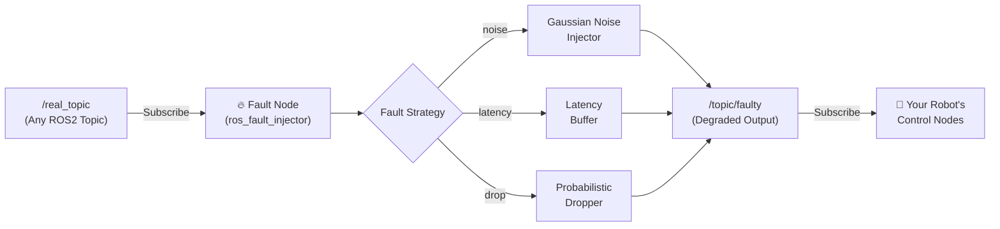

<div align="center">

# 💥 ROS Fault Injector
**Chaos Engineering for Robotics — Battle-Test Your ROS2 Stack Before the Field Does**


[](https://github.com/EngineerAbdullahBinZafar/ros-fault-injector/actions)
[](https://opensource.org/licenses/MIT)
[](https://docs.ros.org/en/humble/index.html)
[](https://python.org)

*If your robot has never been tested under chaos, it has never truly been tested.*

[Why Chaos Engineering?](#-why-chaos-engineering-for-robotics) • [Features](#-features) • [Quick Start](#%EF%B8%8F-quick-start) • [Architecture](#-architecture) • [Examples](#-example-scenarios)

</div>

---

## 🤔 Why Chaos Engineering for Robotics?

Your ROS2 system works perfectly in simulation. But the real world is chaos:

- **Sensor wires vibrate loose** → random spikes in `/imu/data`
- **WiFi congestion hits** → `/cmd_vel` packets arrive 300ms late
- **Hardware glitches** → entire `/scan` topic drops for 2 seconds

**If you haven't tested these failures deliberately, you will discover them catastrophically.** The `ros-fault-injector` lets you *inject* these exact failure modes into any live ROS2 topic — in a controlled, reproducible, configurable way.

---

## ✨ Features

| Fault Type | Description |
|:---|:---|
| 🔊 **Gaussian Noise** | Adds realistic sensor noise to Float32, Vector3, Twist topics |
| ⏱️ **Latency Injection** | Artificially delays message delivery (fixed or random) |
| 💀 **Message Drop** | Drops messages at a configurable probability (0.0–1.0) |
| 📦 **Topic Replay** | Re-publishes stale data to simulate a frozen sensor |

---

## ⚡️ Quick Start

```bash
# 1. Clone and build
cd ~/ros2_ws/src
git clone https://github.com/EngineerAbdullahBinZafar/ros-fault-injector.git
cd ~/ros2_ws
colcon build --packages-select ros_fault_injector
source install/setup.bash

# 2. Launch the injector on any topic (e.g., inject noise into /imu/data)
ros2 run ros_fault_injector fault_node \
    --ros-args \
    -p input_topic:=/imu/data \
    -p output_topic:=/imu/data/faulty \
    -p fault_type:=noise \
    -p noise_std:=0.05

# 3. Visualize the difference in RViz2 or rqt_plot
ros2 run rqt_plot rqt_plot /imu/data/angular_velocity/x /imu/data/faulty/angular_velocity/x
```

---

## 📐 Architecture



---

## 🎭 Example Scenarios

### Scenario 1: Test your navigation stack under sensor noise
```bash
# Inject 5% Gaussian noise into your LiDAR scan
ros2 run ros_fault_injector fault_node \
    --ros-args -p input_topic:=/scan \
                -p fault_type:=noise \
                -p noise_std:=0.05
```

### Scenario 2: Simulate a congested WiFi link
```bash
# Add 250ms random latency to velocity commands
ros2 run ros_fault_injector fault_node \
    --ros-args -p input_topic:=/cmd_vel \
                -p fault_type:=latency \
                -p latency_ms:=250
```

### Scenario 3: Test behaviour when GPS drops out
```bash
# Drop 40% of GPS messages
ros2 run ros_fault_injector fault_node \
    --ros-args -p input_topic:=/fix \
                -p fault_type:=drop \
                -p drop_probability:=0.4
```

---

## 🤝 Contributing
See [CONTRIBUTING.md](CONTRIBUTING.md) and [CODE_OF_CONDUCT.md](CODE_OF_CONDUCT.md).

**Open Bounties:**
- Support for custom message type injection
- YAML-based fault scenario files (e.g. `scenario_wifi_failure.yaml`)
- RViz2 overlay plugin to visualize active faults

## 📄 License
MIT License — See `LICENSE` for details.

## 👤 Author
Built by **Engineer Abdullah Bin Zafar** — [GitHub](https://github.com/EngineerAbdullahBinZafar) · [LinkedIn](https://linkedin.com/in/abdullah-bin-zafar)

*If this saved your robot from a real-world disaster, drop a ⭐!*
